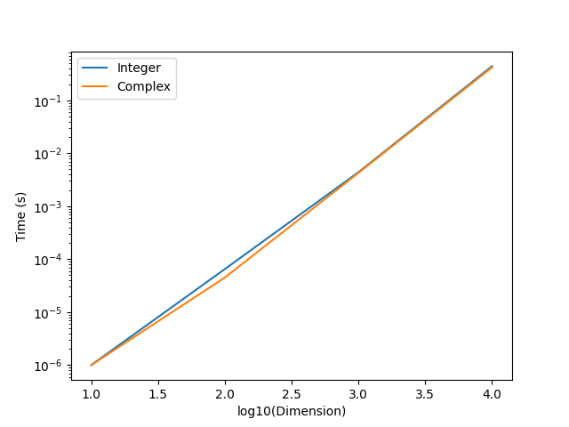

## 代码说明

代码里用 C 语言实现了简单的接口 `interface`。因为复数和整数排序的逻辑时一致的，只需定义类型之间的大小关系就可以从小到大排序。所以可以使用统一的排序函数。

首先为 `Int` 类型和 `Complex` 类型实现比较的接口 `PartialOrd`，唯一的排序函数 `insertion_sort()` 中调用 `PartialOrd` 即可，无需关心具体类型。

排序函数形式如下：

```c
void insertion_sort(void* arr, int len, int elem_size, PartialOrd* partial_ord) {
    char* char_arr = (char*)arr;

    for (int i = 1; i < len; i++) {
        for (int j = i; j > 0; j--) {
            void* a = char_arr + (j - 1) * elem_size;
            void* b = char_arr + j * elem_size;

            // 调用统一的比较接口，无需关心具体类型
            if (partial_ord->partial_cmp(a, b) == GREATER) {
                // 交换 j - 1 和 j 号元素
                char temp[elem_size];
                memcpy(temp, a, elem_size);
                memcpy(a, b, elem_size);
                memcpy(b, temp, elem_size);
            } else {
                break;
            }
        }
    }
}
```

除了传入 `partial_ord` 函数，还需传入元素大小 `elem_size`，用于交换，因为交换啊是用 `memcpy()` 逐个拷贝字节实现的。事实上这在其他语言的接口类运行时也会被存储（传统的继承运行时还会存储虚表指向函数）。

## 运行效率结果

最终耗时如下：

| 规模             | 10       | 100      | 1000     | 10000    |
| ---------------- | -------- | -------- | -------- | -------- |
| 整数插入排序 (s) | 0.000001 | 0.000065 | 0.004398 | 0.442873 |
| 复数插入排序 (s) | 0.000001 | 0.000045 | 0.004278 | 0.422398 |

两者效率大致一样，因为性能瓶颈在于比较和交换次数，均为 $O(N ^ 2)$，而比较本身都是 $O(1)$ 的。

文件夹中的 `draw.py` 绘制了两种排序的时间 - 规模图像：


